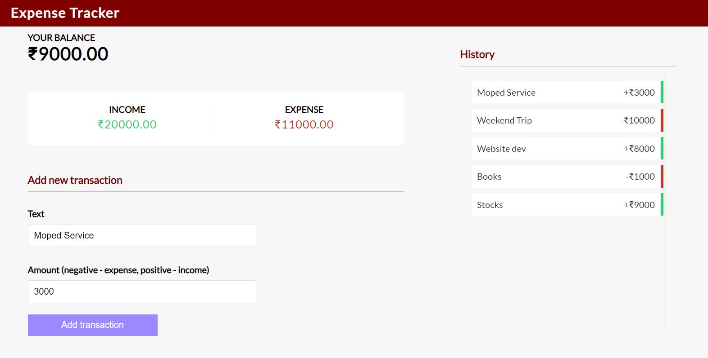

# Expense Tracker

A full-stack web application for tracking personal expenses and income. Built with the MERN stack (MongoDB, Express.js, React.js, Node.js).

## ✨ Features

- 📊 Track income and expenses
- 💰 Real-time balance calculation
- 📱 Responsive design
- 🗄️ Persistent data storage
- ⚡ Fast and intuitive interface

## 🛠️ Tech Stack

- **Frontend**: React.js, CSS3
- **Backend**: Node.js, Express.js
- **Database**: MongoDB
- **Additional Tools**: Axios for API calls, Context API for state management

## 📸 Screenshots

## 👨‍💻 Author

**Ankit Dubey**
- GitHub: [@Ankit-Dubey10](https://github.com/Ankit-Dubey10)

